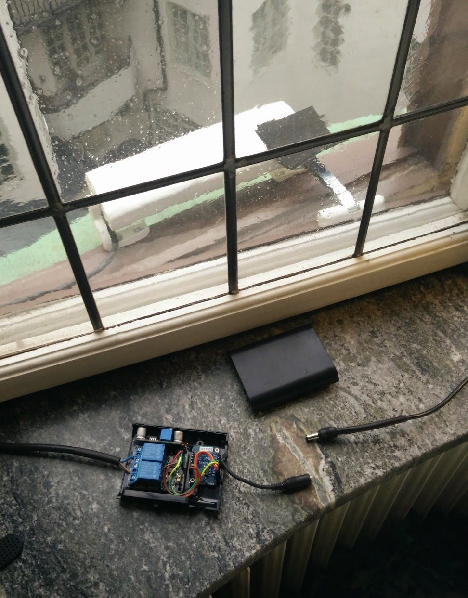

# Automate opening and closing a window
Open and close a window with a small chain motor
  
  
Runs on an ESP8266 plus two relays

Open and closes by: 

- built in schedules (internal clock synced to NTP server on internet)
- MQTT over wifi
- REST & web page over wifi
- Physical button
 
# Hardware

I bought a motor on Ebay here: https://www.ebay.co.uk/itm/SMART-24V-WHITE-Electric-Chain-Actuator-for-inward-outward-opening-windows/291221519543

The motor is supposed to be mounted indoors but since it's in my bedroom I wanted it to be as quiet as possible, so it's on the outside here. I've put a small bit of plastic over the chain to protect it at least somewhat from harsh weather.

